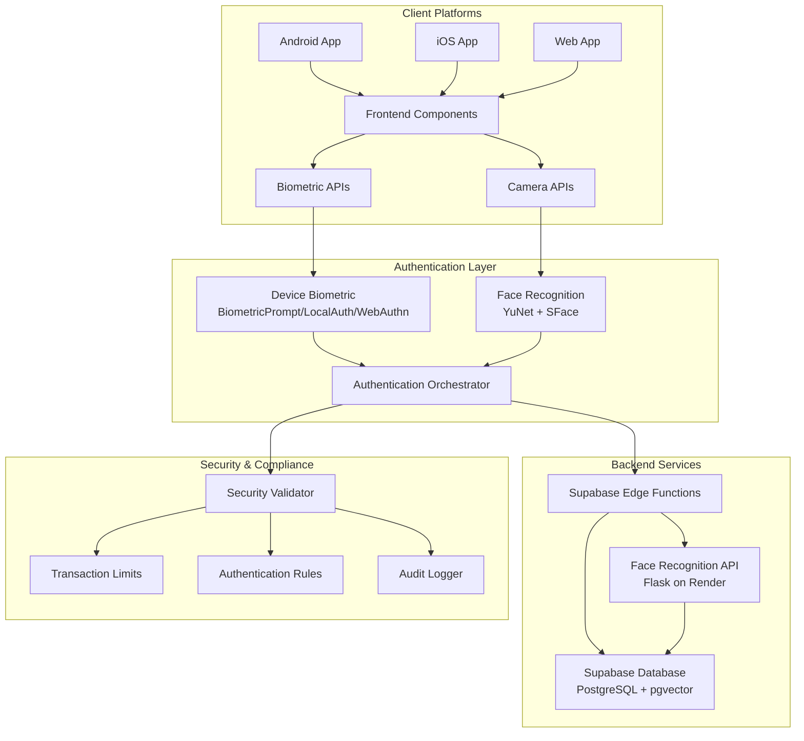
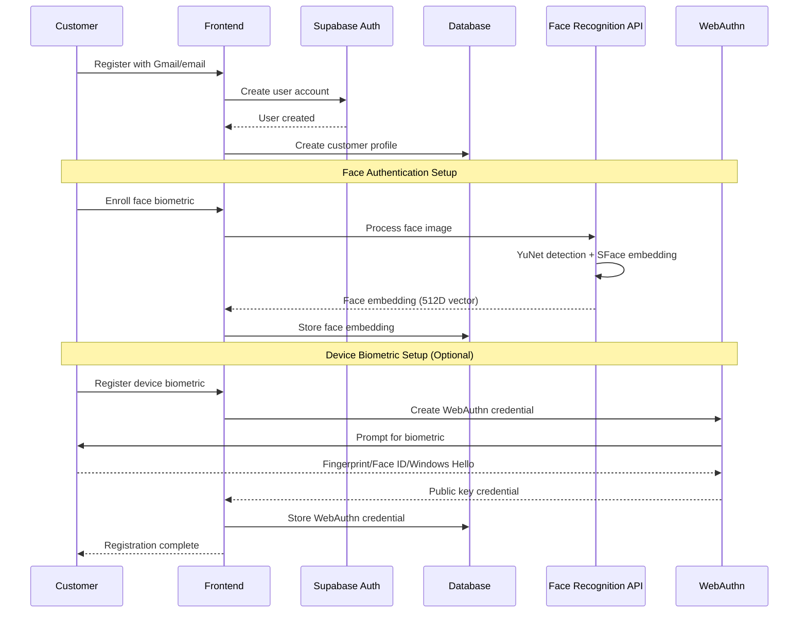
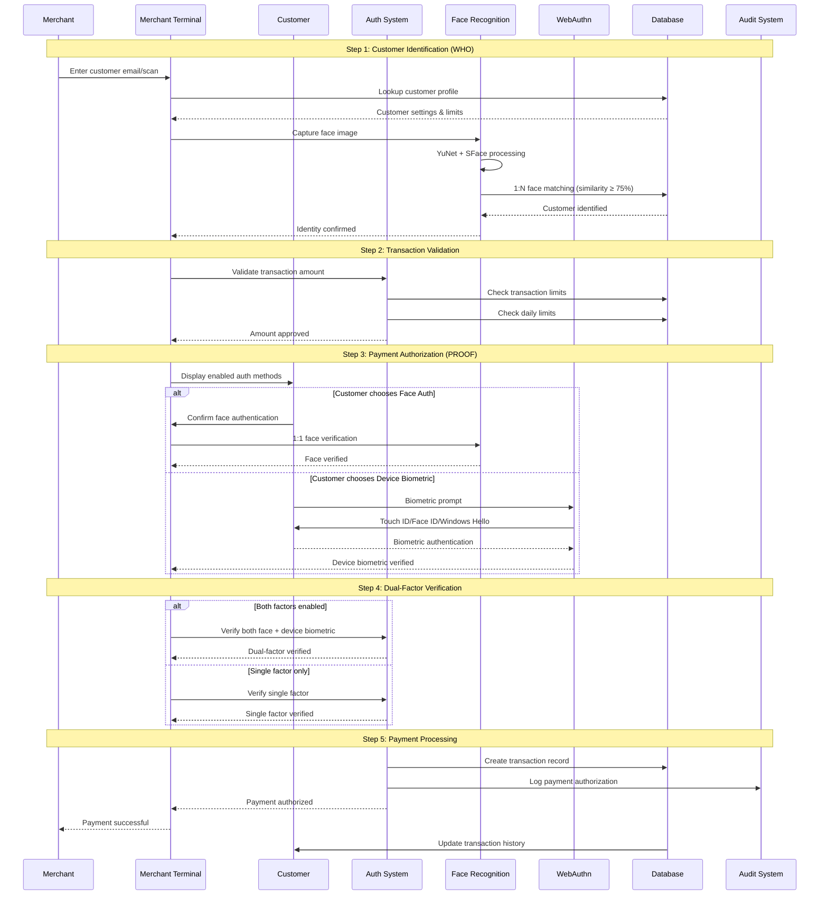

# Design Document: Enhanced Face Pay Authentication and Payment System

## Overview

The Enhanced Face Pay system is a comprehensive multi-factor biometric payment platform that combines facial recognition with device-native biometric authentication (fingerprint, Face ID, Windows Hello) across Android, iOS, and web platforms. The system enforces strict security through dual-factor authentication while maintaining seamless user experience through configurable authentication methods and transaction limits.

## Architecture



## Sequence Diagrams

### Customer Registration Flow



### Enhanced Payment Flow (Multi-Factor)


## Components and Interfaces

### Component 1: Customer Security Settings Manager

**Purpose**: Manages customer authentication preferences and transaction limits

**Interface**:
```typescript
interface SecuritySettingsManager {
  updateTransactionLimit(customerId: string, limit: number): Promise<boolean>
  updateDailyLimit(customerId: string, limit: number): Promise<boolean>
  enableFacePayment(customerId: string): Promise<boolean>
  enableBiometricPayment(customerId: string): Promise<boolean>
  getCustomerSettings(customerId: string): Promise<CustomerSecuritySettings>
  validateTransactionAmount(customerId: string, amount: number): Promise<ValidationResult>
}

interface CustomerSecuritySettings {
  customerId: string
  maxTransactionAmount: number
  dailyTransactionLimit: number
  facePaymentEnabled: boolean
  biometricPaymentEnabled: boolean
  webauthnCredentials: WebAuthnCredential[]
  lastUpdated: Date
}
```

**Responsibilities**:
- Enforce customer-configured transaction limits
- Validate authentication method availability
- Store and retrieve security preferences
- Audit security setting changes

### Component 2: Multi-Platform Biometric Authenticator

**Purpose**: Provides unified biometric authentication across platforms

**Interface**:
```typescript
interface BiometricAuthenticator {
  // Face Recognition
  enrollFace(imageData: ImageData): Promise<FaceEnrollmentResult>
  identifyFace(imageData: ImageData, threshold: number): Promise<FaceIdentificationResult>
  verifyFace(imageData: ImageData, customerId: string, threshold: number): Promise<FaceVerificationResult>
  
  // Device Biometric
  registerWebAuthn(userId: string): Promise<WebAuthnRegistrationResult>
  authenticateWebAuthn(userId: string, challenge: Challenge): Promise<WebAuthnAuthResult>
  
  // Platform Detection
  getSupportedBiometrics(): Promise<BiometricCapability[]>
  isDeviceBiometricAvailable(): Promise<boolean>
}

interface FaceEnrollmentResult {
  success: boolean
  embedding: number[] // 512D vector
  qualityScore: number
  errorMessage?: string
}

interface WebAuthnAuthResult {
  verified: boolean
  authorizationToken: string
  authenticatorName: string
  errorMessage?: string
}
```

**Responsibilities**:
- Abstract platform-specific biometric APIs
- Ensure consistent security standards
- Handle biometric enrollment and verification
- Manage WebAuthn credential lifecycle

### Component 3: Transaction Authorization Engine

**Purpose**: Orchestrates multi-factor authentication for payments

**Interface**:
```typescript
interface TransactionAuthorizationEngine {
  initiatePayment(request: PaymentRequest): Promise<PaymentSession>
  validateCustomerLimits(customerId: string, amount: number): Promise<LimitValidationResult>
  authorizePayment(session: PaymentSession, authFactors: AuthenticationFactors): Promise<AuthorizationResult>
  generateSecureChallenge(): string
  preventReplayAttacks(transactionId: string): Promise<boolean>
}

interface PaymentRequest {
  merchantId: string
  customerEmail: string
  amount: number
  currency: string
  timestamp: Date
}

interface AuthenticationFactors {
  faceVerified?: boolean
  faceEmbedding?: number[]
  faceSimilarity?: number
  deviceBiometricVerified?: boolean
  webauthnSignature?: string
  challenge: string
}
```

**Responsibilities**:
- Coordinate authentication factors
- Enforce business rules and limits
- Generate cryptographic challenges
- Prevent duplicate transactions

### Component 4: Platform-Specific Authentication Handlers

**Purpose**: Handle platform-native biometric authentication

**Android Handler Interface**:
```kotlin
interface AndroidBiometricHandler {
    fun setupBiometricPrompt(activity: FragmentActivity): BiometricPrompt
    fun authenticate(
        promptInfo: BiometricPrompt.PromptInfo,
        onSuccess: (BiometricPrompt.AuthenticationResult) -> Unit,
        onError: (String) -> Unit
    )
    fun isDeviceBiometricAvailable(context: Context): Boolean
}
```

**iOS Handler Interface**:
```swift
protocol IOSBiometricHandler {
    func evaluateBiometricPolicy(
        reason: String,
        completion: @escaping (Bool, Error?) -> Void
    )
    func isBiometricAvailable() -> Bool
    func getBiometricType() -> LABiometryType
}
```

**WebAuthn Handler Interface**:
```typescript
interface WebAuthnHandler {
  createCredential(options: CredentialCreationOptions): Promise<PublicKeyCredential>
  getAssertion(options: CredentialRequestOptions): Promise<PublicKeyCredential>
  isWebAuthnSupported(): boolean
  isUserVerifyingPlatformAuthenticatorAvailable(): Promise<boolean>
}
```

## Data Models

### Enhanced Customer Profile Model

```typescript
interface CustomerProfile {
  id: string // UUID
  userId: string // References auth.users.id
  facepayId: string // Unique identifier for Face Pay
  fullName: string
  email: string
  
  // Security Settings
  securitySettings: {
    maxTransactionAmount: number
    dailyTransactionLimit: number
    facePaymentEnabled: boolean
    biometricPaymentEnabled: boolean
  }
  
  // Biometric Data (NOT raw biometrics)
  faceEmbedding?: number[] // 512D SFace embedding
  enrollmentQuality: number
  
  // WebAuthn Credentials
  webauthnCredentials: WebAuthnCredential[]
  
  // Metadata
  createdAt: Date
  lastAuthenticationAt?: Date
  accountStatus: 'active' | 'suspended' | 'disabled'
}
```

### Transaction Authorization Model

```typescript
interface TransactionAuthorization {
  id: string
  transactionId: string
  customerId: string
  merchantId: string
  
  // Authentication Details
  authenticationFactors: {
    face: {
      verified: boolean
      similarity: number
      embeddingId: string
    }
    deviceBiometric: {
      verified: boolean
      credentialId?: string
      authenticatorType: string
    }
  }
  
  // Security Metadata
  challenge: string
  ipAddress: string
  userAgent: string
  geolocation?: {
    latitude: number
    longitude: number
  }
  
  // Risk Assessment
  riskScore: number // 0.0 to 1.0
  fraudFlags: string[]
  
  // Timestamps
  createdAt: Date
  verifiedAt?: Date
}
```

### WebAuthn Credential Model

```typescript
interface WebAuthnCredential {
  id: string
  userId: string
  credentialId: string // Base64URL encoded
  publicKey: ArrayBuffer // NOT biometric data
  counter: number
  
  // Device Information
  transports: AuthenticatorTransport[]
  deviceType: 'platform' | 'cross-platform'
  aaguid?: string
  
  // User-Friendly Information
  friendlyName: string // "Windows Hello", "Touch ID", etc.
  
  // Security
  createdAt: Date
  lastUsedAt?: Date
  isActive: boolean
}
```
## Algorithmic Pseudocode

### Main Payment Processing Algorithm

```pascal
ALGORITHM processPaymentWithMultiFactor(paymentRequest, customerSettings)
INPUT: paymentRequest (merchant, customer, amount), customerSettings (limits, auth methods)
OUTPUT: authorizationResult (success/failure with details)

BEGIN
  ASSERT paymentRequest.amount > 0
  ASSERT paymentRequest.merchantId IS NOT NULL
  
  // Step 1: Validate transaction limits
  limitValidation ← validateTransactionLimits(paymentRequest, customerSettings)
  IF NOT limitValidation.valid THEN
    RETURN AuthorizationResult(false, "Transaction limit exceeded: " + limitValidation.reason)
  END IF
  
  // Step 2: Generate secure challenge for this session
  challenge ← generateSecureChallenge()
  session ← createPaymentSession(paymentRequest, challenge)
  
  // Step 3: Determine required authentication factors
  requiredFactors ← determineAuthFactors(customerSettings)
  collectedFactors ← initializeFactorCollection()
  
  // Step 4: Collect authentication factors in parallel
  FOR each factor IN requiredFactors DO
    CASE factor OF
      "face": 
        faceResult ← authenticateWithFace(session.customerId, challenge)
        collectedFactors.face ← faceResult
      "device_biometric":
        deviceResult ← authenticateWithDeviceBiometric(session.userId, challenge)
        collectedFactors.deviceBiometric ← deviceResult
    END CASE
  END FOR
  
  // Step 5: Validate all factors met minimum requirements
  validationResult ← validateAllFactors(collectedFactors, requiredFactors)
  IF NOT validationResult.allValid THEN
    logFailedAuthentication(session, validationResult)
    RETURN AuthorizationResult(false, "Authentication failed: " + validationResult.failureReason)
  END IF
  
  // Step 6: Final authorization and transaction creation
  transactionId ← generateUniqueTransactionId()
  authRecord ← createAuthorizationRecord(session, collectedFactors, transactionId)
  
  // Step 7: Commit transaction
  dbResult ← commitTransaction(authRecord)
  IF dbResult.success THEN
    logSuccessfulPayment(authRecord)
    RETURN AuthorizationResult(true, transactionId)
  ELSE
    RETURN AuthorizationResult(false, "Transaction processing failed")
  END IF
END
```

**Preconditions:**
- paymentRequest contains valid merchant and customer identifiers
- paymentRequest.amount is positive number
- customerSettings contains valid authentication preferences
- Database connectivity is available

**Postconditions:**
- If successful: transaction record created with unique ID
- If failed: detailed error message provided
- All authentication attempts logged for audit
- No duplicate transactions processed within 60-second window

**Loop Invariants:**
- All processed authentication factors remain valid throughout collection
- Challenge remains cryptographically secure and unused
- Session state remains consistent across factor collection

### Face Recognition Authentication Algorithm

```pascal
ALGORITHM authenticateWithFace(customerId, challenge)
INPUT: customerId (customer identifier), challenge (session challenge)
OUTPUT: faceAuthResult (verification status with similarity score)

BEGIN
  ASSERT customerId IS NOT NULL
  ASSERT challenge IS NOT NULL
  
  // Step 1: Capture and process face image
  faceImage ← captureFaceImage()
  IF faceImage IS NULL THEN
    RETURN FaceAuthResult(false, 0.0, "Image capture failed")
  END IF
  
  // Step 2: YuNet face detection
  detectionResult ← yunetDetectFace(faceImage)
  IF NOT detectionResult.faceDetected THEN
    RETURN FaceAuthResult(false, 0.0, "No face detected in image")
  END IF
  
  // Step 3: SFace embedding generation
  currentEmbedding ← sfaceGenerateEmbedding(detectionResult.faceRegion)
  IF currentEmbedding IS NULL THEN
    RETURN FaceAuthResult(false, 0.0, "Face embedding generation failed")
  END IF
  
  // Step 4: Retrieve stored face embedding
  storedEmbedding ← getStoredFaceEmbedding(customerId)
  IF storedEmbedding IS NULL THEN
    RETURN FaceAuthResult(false, 0.0, "No face template enrolled for customer")
  END IF
  
  // Step 5: Calculate cosine similarity
  similarity ← cosineSimilarity(currentEmbedding, storedEmbedding)
  
  // Step 6: Apply threshold validation
  threshold ← 0.75 // 75% minimum similarity
  verified ← (similarity >= threshold)
  
  // Step 7: Log authentication attempt
  logFaceAuthentication(customerId, similarity, verified, challenge)
  
  IF verified THEN
    RETURN FaceAuthResult(true, similarity, "Face verified successfully")
  ELSE
    RETURN FaceAuthResult(false, similarity, "Face verification failed - similarity below threshold")
  END IF
END
```

**Preconditions:**
- Camera access is available and functional
- YuNet and SFace models are loaded and initialized
- Customer has enrolled face embedding in database
- customerId references valid customer record

**Postconditions:**
- Similarity score calculated and returned (0.0 to 1.0 range)
- Authentication attempt logged with timestamp
- Face verification status determined based on threshold
- No biometric template data exposed in logs or responses

**Loop Invariants:** N/A (no loops in this algorithm)

### WebAuthn Device Biometric Algorithm

```pascal
ALGORITHM authenticateWithDeviceBiometric(userId, challenge)
INPUT: userId (user identifier), challenge (cryptographic challenge)
OUTPUT: webauthnResult (verification status with credential info)

BEGIN
  ASSERT userId IS NOT NULL
  ASSERT challenge IS NOT NULL AND challenge.length >= 32
  
  // Step 1: Retrieve user's registered credentials
  credentials ← getWebAuthnCredentials(userId)
  IF credentials.isEmpty() THEN
    RETURN WebAuthnResult(false, NULL, "No WebAuthn credentials registered")
  END IF
  
  // Step 2: Prepare authentication options
  authOptions ← createAuthenticationOptions(challenge, credentials)
  
  // Step 3: Platform-specific biometric prompt
  platformResult ← NULL
  CASE detectPlatform() OF
    "android":
      platformResult ← androidBiometricPrompt(authOptions)
    "ios":
      platformResult ← iosLocalAuthentication(authOptions)
    "web":
      platformResult ← webauthnNavigatorCredentialsGet(authOptions)
  END CASE
  
  IF NOT platformResult.success THEN
    logFailedBiometric(userId, platformResult.errorType, challenge)
    RETURN WebAuthnResult(false, NULL, "Device biometric authentication failed")
  END IF
  
  // Step 4: Verify cryptographic signature
  credential ← findCredentialById(platformResult.credentialId)
  signatureValid ← verifyWebAuthnSignature(
    platformResult.signature,
    credential.publicKey,
    challenge,
    platformResult.authenticatorData
  )
  
  // Step 5: Update credential counter (replay attack prevention)
  IF signatureValid AND platformResult.counter > credential.counter THEN
    updateCredentialCounter(credential.id, platformResult.counter)
    logSuccessfulBiometric(userId, credential.friendlyName, challenge)
    RETURN WebAuthnResult(true, credential.friendlyName, "Device biometric verified")
  ELSE
    logSuspiciousActivity(userId, "Counter rollback detected", challenge)
    RETURN WebAuthnResult(false, NULL, "Signature verification failed or replay attack detected")
  END IF
END
```

**Preconditions:**
- User has at least one registered WebAuthn credential
- Device supports biometric authentication (TouchID, FaceID, Windows Hello, fingerprint)
- Challenge is cryptographically secure random bytes (≥32 bytes)
- WebAuthn APIs are available on the platform

**Postconditions:**
- Cryptographic signature verified using stored public key
- Credential counter updated to prevent replay attacks
- Authentication attempt logged with device information
- No raw biometric data accessed, processed, or stored

**Loop Invariants:**
- All retrieved credentials remain valid throughout authentication process
- Challenge remains unmodified throughout signature verification
- Credential counters maintain strict monotonic increasing property

## Key Functions with Formal Specifications

### Function 1: validateTransactionLimits()

```typescript
function validateTransactionLimits(
  customerId: string, 
  amount: number, 
  settings: CustomerSecuritySettings
): LimitValidationResult
```

**Preconditions:**
- `customerId` is non-empty string referencing valid customer
- `amount` is positive number (> 0)
- `settings` contains valid limit configuration
- `settings.maxTransactionAmount >= 0`
- `settings.dailyTransactionLimit >= 0`

**Postconditions:**
- Returns validation result with boolean success flag
- If valid: `result.valid === true`
- If invalid: `result.reason` contains descriptive error message
- No mutations to input parameters
- Daily spending calculation includes only transactions from current calendar day

**Loop Invariants:** N/A (no loops)

### Function 2: generateSecureChallenge()

```typescript
function generateSecureChallenge(): string
```

**Preconditions:**
- Cryptographically secure random number generator is available
- System entropy pool has sufficient entropy

**Postconditions:**
- Returns base64-encoded string of length 64 characters
- Generated value has 256 bits of entropy
- Each invocation produces unique, unpredictable result
- Result suitable for cryptographic challenge-response protocols

**Loop Invariants:** N/A (no loops)

### Function 3: cosineSimilarity()

```typescript
function cosineSimilarity(vectorA: number[], vectorB: number[]): number
```

**Preconditions:**
- `vectorA` and `vectorB` are non-empty arrays
- `vectorA.length === vectorB.length`
- Both vectors contain only numeric values
- Neither vector is zero vector (all elements zero)

**Postconditions:**
- Returns similarity score in range [-1.0, 1.0]
- Higher values indicate greater similarity
- Result is symmetric: `cosineSimilarity(A, B) === cosineSimilarity(B, A)`
- No mutations to input vectors

**Loop Invariants:**
- For similarity calculation loop: running dot product and magnitude calculations remain numerically stable
- All processed vector elements contribute to final similarity score

## Example Usage

```typescript
// Example 1: Complete payment flow with dual-factor authentication
async function processEnhancedPayment() {
  // Initialize payment request
  const paymentRequest: PaymentRequest = {
    merchantId: "MERCH-12345",
    customerEmail: "customer@gmail.com",
    amount: 299.99,
    currency: "INR",
    timestamp: new Date()
  }
  
  // Get customer security settings
  const customerSettings = await securityManager.getCustomerSettings("CUST-67890")
  
  // Validate transaction is within limits
  const limitValidation = await authEngine.validateCustomerLimits("CUST-67890", 299.99)
  if (!limitValidation.valid) {
    throw new Error(`Transaction rejected: ${limitValidation.reason}`)
  }
  
  // Initiate payment session with secure challenge
  const session = await authEngine.initiatePayment(paymentRequest)
  
  // Collect authentication factors based on customer preferences
  const authFactors: AuthenticationFactors = {
    challenge: session.challenge
  }
  
  // Factor 1: Face authentication (if enabled)
  if (customerSettings.facePaymentEnabled) {
    const faceResult = await biometricAuth.verifyFace(
      capturedImage,
      "CUST-67890",
      0.75
    )
    authFactors.faceVerified = faceResult.verified
    authFactors.faceSimilarity = faceResult.similarity
  }
  
  // Factor 2: Device biometric (if enabled)
  if (customerSettings.biometricPaymentEnabled) {
    const webauthnResult = await biometricAuth.authenticateWebAuthn(
      "USER-UUID-123",
      { amount: 299.99, merchantId: "MERCH-12345" }
    )
    authFactors.deviceBiometricVerified = webauthnResult.verified
    authFactors.webauthnSignature = webauthnResult.signature
  }
  
  // Authorize payment with collected factors
  const authResult = await authEngine.authorizePayment(session, authFactors)
  
  if (authResult.success) {
    console.log(`Payment authorized: ${authResult.transactionId}`)
    return authResult
  } else {
    throw new Error(`Payment failed: ${authResult.errorMessage}`)
  }
}

// Example 2: Platform-specific biometric setup
async function setupBiometricAuth(platform: string) {
  switch (platform) {
    case 'android':
      const biometricPrompt = androidHandler.setupBiometricPrompt(activity)
      await androidHandler.authenticate(
        promptInfo,
        (result) => console.log('Android biometric success'),
        (error) => console.error('Android biometric failed:', error)
      )
      break
      
    case 'ios':
      const available = await iosHandler.isBiometricAvailable()
      if (available) {
        await iosHandler.evaluateBiometricPolicy(
          "Authenticate for Face Pay",
          (success, error) => {
            if (success) console.log('iOS biometric success')
            else console.error('iOS biometric failed:', error)
          }
        )
      }
      break
      
    case 'web':
      if (webauthnHandler.isWebAuthnSupported()) {
        const credential = await webauthnHandler.createCredential(options)
        console.log('WebAuthn credential created:', credential.id)
      }
      break
  }
}

// Example 3: Security settings configuration
async function configureCustomerSecurity(customerId: string) {
  const settings: CustomerSecuritySettings = {
    customerId,
    maxTransactionAmount: 5000,  // ₹5,000 per transaction
    dailyTransactionLimit: 20000, // ₹20,000 per day
    facePaymentEnabled: true,
    biometricPaymentEnabled: true,
    webauthnCredentials: [],
    lastUpdated: new Date()
  }
  
  // Update settings
  await securityManager.updateTransactionLimit(customerId, 5000)
  await securityManager.enableFacePayment(customerId)
  await securityManager.enableBiometricPayment(customerId)
  
  // Verify configuration
  const updatedSettings = await securityManager.getCustomerSettings(customerId)
  console.log('Security settings updated:', updatedSettings)
}
```
## Correctness Properties

The Enhanced Face Pay system must satisfy the following universal quantification properties:

### Security Properties

**Property 1: Authentication Factor Integrity**
```typescript
∀ payment ∈ Payments, factors ∈ AuthenticationFactors:
  authorizePayment(payment, factors) = success 
  ⟹ 
  (factors.faceVerified = true ∧ factors.faceSimilarity ≥ 0.75) 
  ∨ 
  (factors.deviceBiometricVerified = true ∧ validWebAuthnSignature(factors.webauthnSignature))
```

**Property 2: Transaction Limit Enforcement**
```typescript
∀ customer ∈ Customers, transaction ∈ Transactions:
  processTransaction(customer, transaction) = success
  ⟹
  transaction.amount ≤ customer.securitySettings.maxTransactionAmount
  ∧
  dailySpending(customer, today()) + transaction.amount ≤ customer.securitySettings.dailyTransactionLimit
```

**Property 3: Replay Attack Prevention**
```typescript
∀ challenge ∈ Challenges, t1, t2 ∈ Timestamps:
  useChallenge(challenge, t1) = success ∧ t2 > t1
  ⟹
  useChallenge(challenge, t2) = failure
```

### Privacy Properties

**Property 4: Biometric Data Protection**
```typescript
∀ system_output ∈ SystemOutputs:
  ¬contains(system_output, RawBiometricData)
  ∧
  ¬contains(system_output, FingerprintTemplate)
  ∧
  ¬accessible_to_merchant(system_output.face_embedding)
```

**Property 5: Customer Configuration Autonomy**
```typescript
∀ customer ∈ Customers, auth_method ∈ AuthenticationMethods:
  customer.securitySettings.enabled(auth_method) = false
  ⟹
  ¬required_for_payment(customer, auth_method)
```

### Availability Properties

**Property 6: Platform Independence**
```typescript
∀ platform ∈ {Android, iOS, Web}, customer ∈ Customers:
  has_compatible_biometric(platform, customer)
  ⟹
  can_complete_payment(platform, customer)
```

**Property 7: Graceful Degradation**
```typescript
∀ customer ∈ Customers:
  (enabled(customer, face_auth) ∨ enabled(customer, device_biometric))
  ⟹
  can_authenticate(customer)
```

## Error Handling

### Error Scenario 1: Biometric Authentication Failure

**Condition**: Face recognition similarity below threshold (< 75%) or device biometric rejection
**Response**: 
- Log authentication attempt with failure reason
- Display user-friendly error message
- Offer alternative authentication method if available
- Implement exponential backoff for repeated failures

**Recovery**: 
- Allow retry after 30-second cooldown
- Suggest switching to alternative biometric method
- Provide customer service contact for account recovery

### Error Scenario 2: Transaction Limit Exceeded

**Condition**: Payment amount exceeds customer's configured limits
**Response**:
- Reject transaction immediately before authentication
- Display specific limit that was exceeded
- Show current limit values to customer
- Offer option to modify limits (with additional verification)

**Recovery**:
- Customer can reduce transaction amount
- Customer can increase limits through security settings
- Split transaction into multiple smaller payments

### Error Scenario 3: Network Connectivity Issues

**Condition**: Loss of connection to Supabase or Face Recognition API
**Response**:
- Implement offline transaction queueing
- Cache customer settings locally with TTL
- Use local biometric validation where possible
- Display clear network status indicators

**Recovery**:
- Automatic retry with exponential backoff
- Queue transactions for processing when connection restored
- Sync cached data upon reconnection

### Error Scenario 4: WebAuthn Not Supported

**Condition**: Device or browser lacks WebAuthn support
**Response**:
- Detect platform capabilities on startup
- Gracefully disable device biometric options
- Fall back to face-only authentication
- Inform user about limited functionality

**Recovery**:
- Provide guidance for browser/OS updates
- Suggest alternative devices if available
- Maintain full face authentication functionality

## Testing Strategy

### Unit Testing Approach

**Core Components Testing:**
- **Biometric Authenticator**: Mock face embeddings and WebAuthn responses
- **Security Settings Manager**: Test limit validation logic with edge cases
- **Transaction Engine**: Validate authentication factor combinations
- **Platform Handlers**: Mock platform APIs for consistent testing

**Key Test Cases:**
- Transaction limits: boundary testing (0, limit-1, limit, limit+1)
- Face similarity: threshold boundary testing (74.9%, 75%, 75.1%)
- WebAuthn: credential validation and counter management
- Error handling: network failures, timeouts, invalid inputs

**Coverage Goals:**
- Line coverage: ≥ 90%
- Branch coverage: ≥ 85%
- Function coverage: 100%
- Critical path coverage: 100%

### Property-Based Testing Approach

**Property Test Library**: fast-check (JavaScript/TypeScript)

**Test Properties:**

1. **Transaction Limit Invariant**:
```typescript
fc.property(
  fc.float({ min: 0, max: 100000 }), // transaction amount
  fc.float({ min: 0, max: 100000 }), // limit
  (amount, limit) => {
    const result = validateTransactionLimit(amount, limit)
    return (amount <= limit) === result.valid
  }
)
```

2. **Cosine Similarity Symmetry**:
```typescript
fc.property(
  fc.array(fc.float(), { minLength: 512, maxLength: 512 }),
  fc.array(fc.float(), { minLength: 512, maxLength: 512 }),
  (vectorA, vectorB) => {
    const sim1 = cosineSimilarity(vectorA, vectorB)
    const sim2 = cosineSimilarity(vectorB, vectorA)
    return Math.abs(sim1 - sim2) < 0.0001 // Allow floating point precision
  }
)
```

3. **Challenge Uniqueness**:
```typescript
fc.property(
  fc.integer({ min: 1, max: 1000 }),
  (iterations) => {
    const challenges = Array.from({ length: iterations }, () => generateSecureChallenge())
    const uniqueChallenges = new Set(challenges)
    return challenges.length === uniqueChallenges.size
  }
)
```

### Integration Testing Approach

**Cross-Platform Integration:**
- Test WebAuthn flow across Chrome, Safari, Edge
- Validate face recognition consistency across different cameras
- Ensure database operations work across all platforms

**API Integration:**
- Supabase Edge Functions with mocked and real data
- Face Recognition API with various image qualities
- WebAuthn server verification with different authenticator types

**End-to-End Scenarios:**
- Complete customer registration and payment flow
- Multi-device authentication testing
- Concurrent payment processing
- Failure recovery and retry mechanisms

## Performance Considerations

**Face Recognition Optimization:**
- YuNet + SFace processing: Target < 2 seconds on mobile devices
- Embedding comparison: < 100ms for similarity calculation
- Batch processing for multiple face candidates
- Image preprocessing optimization for consistent quality

**Database Performance:**
- pgvector indexes for fast face embedding search (HNSW algorithm)
- Connection pooling for high-concurrency scenarios
- Read replicas for transaction history queries
- Proper indexing on customer_id and timestamp fields

**WebAuthn Efficiency:**
- Credential ID indexing for fast lookup
- Counter update optimization to prevent lock contention
- Challenge cleanup with automated expiration
- Parallel credential validation for users with multiple devices

**Caching Strategy:**
- Customer security settings: 5-minute TTL
- Face embeddings: Cache in memory during active sessions
- WebAuthn credentials: Cache after first authentication
- Transaction limits: Real-time validation with cached daily totals

## Security Considerations

**Threat Model Analysis:**

1. **Biometric Spoofing**: Mitigated by dual-factor requirement and liveness detection
2. **Credential Theft**: WebAuthn credentials are device-bound and unusable elsewhere
3. **Man-in-the-Middle**: TLS encryption and WebAuthn origin validation
4. **Replay Attacks**: Cryptographic challenges and counter mechanisms
5. **Social Engineering**: Customer education and clear authentication prompts

**Data Protection:**
- Face embeddings encrypted at rest using AES-256
- WebAuthn private keys never leave secure hardware
- Transaction data anonymized in logs
- GDPR compliance for EU customers

**Audit Requirements:**
- All authentication attempts logged with timestamps
- Payment authorizations tracked with full factor details
- Security setting changes require admin approval
- Regular security assessment and penetration testing

**Access Control:**
- Merchant isolation: Cannot access other merchant's data
- Customer data: Accessible only to authenticated customer
- Administrative functions: Role-based access control
- API rate limiting: Per-user and per-IP restrictions

## Dependencies

**Core Dependencies:**
- **Supabase**: Database, authentication, Edge Functions
- **@simplewebauthn/browser**: WebAuthn client-side implementation
- **@mediapipe/tasks-vision**: Face detection and processing
- **React/React Native**: Cross-platform UI framework
- **@tensorflow/tfjs**: Machine learning model execution

**Platform-Specific:**
- **Android**: BiometricPrompt, CameraX APIs
- **iOS**: LocalAuthentication, AVFoundation frameworks
- **Web**: WebAuthn API, getUserMedia for camera access

**Backend Services:**
- **Face Recognition API**: YuNet + SFace processing (Flask on Render)
- **PostgreSQL with pgvector**: Vector similarity search
- **Supabase Edge Functions**: Deno runtime for serverless logic

**Security Libraries:**
- **@simplewebauthn/server**: WebAuthn server-side verification
- **crypto**: Secure random challenge generation
- **bcrypt**: Password hashing (if needed for fallback auth)

**Development Tools:**
- **Vite**: Build tool and development server
- **Vitest**: Unit testing framework
- **fast-check**: Property-based testing
- **ESLint**: Code quality and security linting

**Monitoring and Analytics:**
- **Supabase Analytics**: Usage metrics and performance monitoring
- **Custom audit logging**: Authentication and payment tracking
- **Error tracking**: Centralized error collection and alerting

**Compliance:**
- **GDPR**: Data protection for EU customers
- **PCI DSS**: Payment processing security standards
- **FIDO Alliance**: WebAuthn specification compliance
- **ISO/IEC 30107**: Biometric presentation attack detection